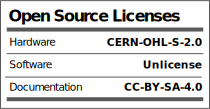
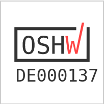
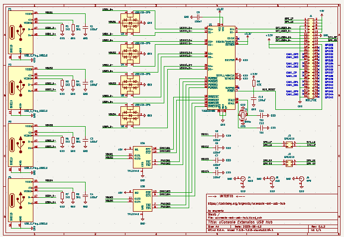
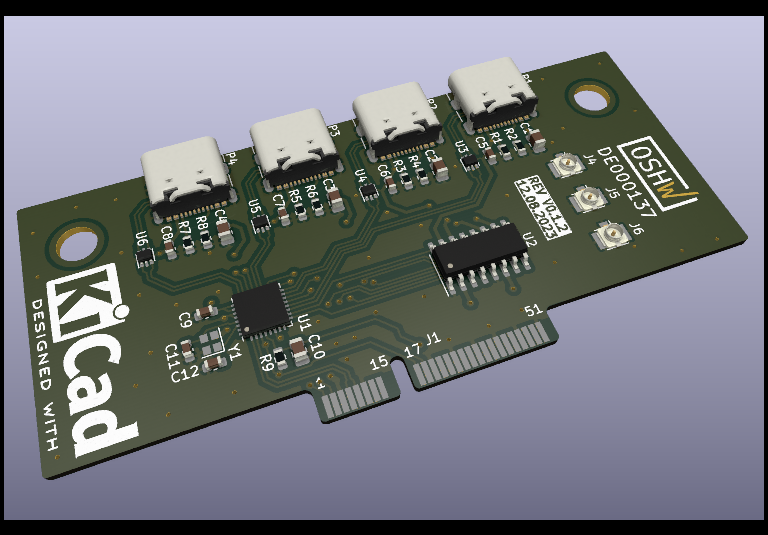
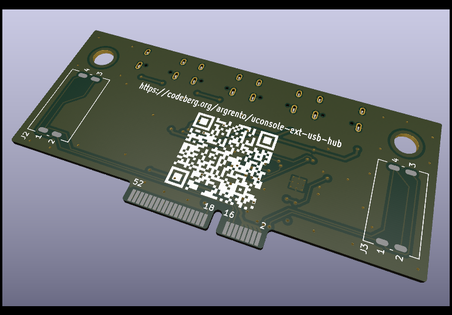

Licence | OSHWA
:-------------------------:|:-------------------------:
 | 

# uConsole USB Hub

This extension board adds 4 additional USB ports to the [uConsole](https://www.clockworkpi.com/uconsole).

## Schematic

## PCB

## Changelog
* 0.1.1
    * Schematic
        * No changes
    * PCB
        * Add OSHW certification
        * Add some info labels and QR code to this repo
* 0.1.0 -- **Production Release**
    * Schematic
        * `HUB_RESET` is now connected to `GPIO28`
        * `U3`, `U4`, `U5`, `U6` are rotated to simplify pcb
    * PCB
        * First PCB version
* 0.0.2
    * Schematic
        * Add speakers
* 0.0.1
    * Initial release